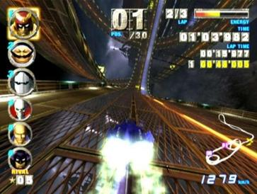

# F-Zero GX

## The Most Exhilarating Racing Ever Made

 F-Zero GX is a futuristic racing video game for the Nintendo Gamecube released in mid-2003. It is the first in the F-Zero series to be developed by Amusement Visions (a department of Sega) and correspondingly released in arcades as F-Zero AX as a part of the Triforce System.

- 30 racers for each course
- Tracks includes enclosed tubes, cylinders, and rollercoaster-esque paths
- Story Mode as Captain Falcon

*[https://nintendo.fandom.com/wiki/F-Zero_GX]